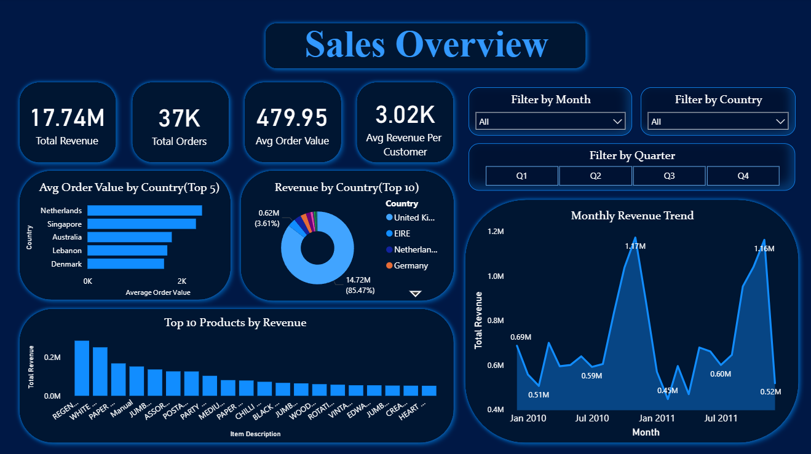
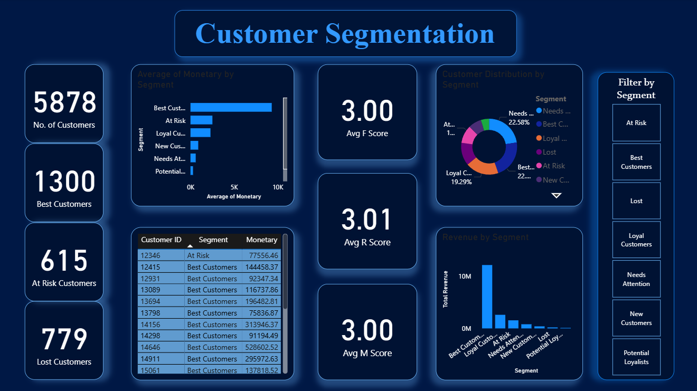

# Retail Analytics Project

## Overview
End-to-end data analytics project analyzing 1M+ transactions from a 
UK-based online retailer (2009–2011). The project covers data cleaning, 
exploratory analysis, RFM customer segmentation, SQL analysis, and 
an interactive Power BI dashboard.

## Dashboard Preview

### Sales Overview Dashboard

### Customer Segmentation Dashboard

## Project Workflow

1. Data Cleaning using Python
2. Exploratory Data Analysis (EDA)
3. RFM Feature Engineering
4. Customer Segmentation
5. SQL Business Analysis
6. Dashboard Development in Power BI

## Key Findings
- £17.7M total revenue across 36,969 orders from 5,878 customers
- Clear seasonal pattern, revenue peaks every November (Q4)
- UK accounts for 83% of revenue; EIRE is the #1 international market
- Best Customers (22% of base) generate 68.4% of total revenue
- 23.8% of customers are At Risk or Lost :- key retention opportunity

## Business Recommendations

- Focus retention campaigns on At Risk and Lost customers.
- Launch loyalty programs for Best Customers.
- Increase inventory planning before Q4 demand spikes.
- Expand marketing in top-performing international markets such as EIRE.

## Tools Used
- Python (Pandas, Matplotlib, Seaborn): cleaning & EDA
- SQL (SQL Server) : business queries, CTEs, window functions
- Power BI : interactive 2-page dashboard

## Project Structure
- notebooks/ - Python notebooks for cleaning and RFM segmentation
- sql/ - 7 SQL queries from basic aggregations to window functions
- dashboard/ - Power BI .pbix file
- data/ - cleaned datasets

## Dataset
UCI Machine Learning Repository - Online Retail II
https://archive.ics.uci.edu/dataset/502/online+retail+ii